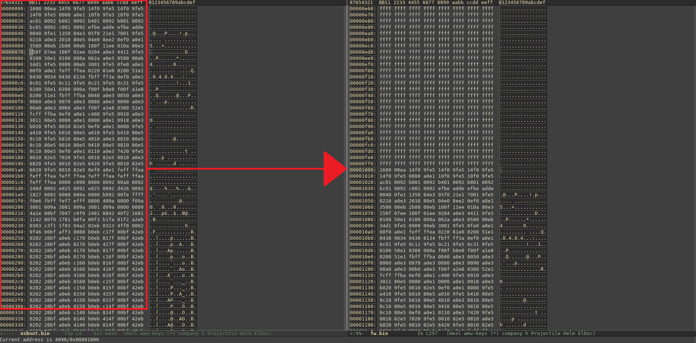
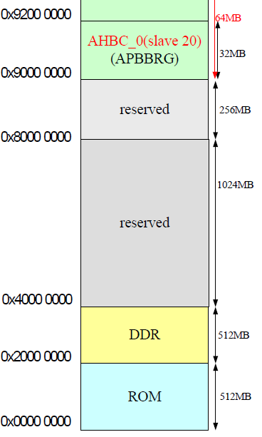

# gm8136_sdk
source code for the system running on the grain media gm8136 soc which is used by many cheap webcams

Everything in this repo is prehistoric:

- GCC v4.4.0
- Buildroot 2012.02
- U-Boot 2013.01
- Linux Kernel 3.3

# Reverse Engineering

## Bootrom

**WARNING: a lot of the information in the following text is based on assumptions which are backed by experiences with other SoCs as nothing of the Bootrom operation is described in any document i was able to find. Combined with the very incomplete Hardware User Manual of the IC I am unfortunately not able to do much more than guessing (if someday i will connect JTAG to the board and try to analyze the chip via JLink (or even a Lauterbach) i can give here more precise Information. If one reader has additional information about the internal structure of this chip or bootrom i woul very greatful to hear about that. Until that day i will stay with guessing!**

The bootrom of the SoC is completely undocumented (at least i was not able to find anything about its operation online). What i could reverse engineer so far is that the bootrom loads the first stage loader from the NVM (SPI NOR/NAND) from address **0x1000** to the (undocumented) SRAM Address at **0x92000000** (This memory areas is only marked as reserved, but no mention that it is SRAM in the memory map). 

The first stage loader is called (for an unknown reason **nsboot**). The source code of nsboot is located under Software/Embedded_Linux/source/gm8136_nsboot. You can compile it with the cross gcc e.g. from linaro (for example this here https://releases.linaro.org/components/toolchain/binaries/7.5-2019.12/arm-linux-gnueabi/gcc-linaro-7.5.0-2019.12-x86_64_arm-linux-gnueabi.tar.xz).

**ATTENTION: Do not use the arm-linux-gnueabihf because this one can only be used with VFP (hardware fpu -> which should be the reason why the HF is appended to the toolcain triplet) which the gm8136 core arm926ejs (armv4 ISA) doesn´t have (soft-fpu only). Any effort doing so will result in a not linkable libgcc, which seems to have VFP support hardcoded into the library** 

### How the Bootrom functionality was reverse engineered
This analysis was done by reading out the XM25QH128A located on the ESOLOM wlan webcam. The reading can be done by two different methods

1: Connect the UART wires to your PC. Let the system boot and press any key to stop in u-boot
  - insert an mmc card into the slot (ATTENTION: with this method you will destroy the MBR/GPT of the mmc card, only use it if it does not contain important data)
  - type in into the uart prompt: **sf read 0x2000000 0 0x1000000; mmc write 0x2000000 0 0x8000**. This will write the full SPI flash (16MB) content at the beginning of the mmc 
  - insert the mmc card into your machine
  - run: **dd if=/dev/$DEV_OF_YOUR_EMMC of=~/fw.bin bs=512 count=32768**
  
  
2: Buy some cheap BIOS programmer like this here: https://www.amazon.de/KeeYees-Programmer-Konverter-Motherboard-Routing/dp/B07SHSRFS8 and hook it up to the SPI chip on the board
  - install the flashrom utility (e.g. build it from here https://github.com/flashrom/flashrom)
  - run: **flashrom --programmer ch341a_spi -r ~/fw.bin**
  
 In both cases you will get the **~/fw.bin** binary containing the full SPI flash content which can be analysed (e.g. using the awesome binwalk utility from here: https://github.com/ReFirmLabs/binwalk.
 
 #### Building nsboot
 
 To find out from which location the bootrom loads the nsboot, nsboot was build from source using the linaro toolchain (link see above). Simply open the Makefile and replace the CROSS_COMPILE variable to point to the downloaded linaro toolchain. 
 
Now run **make**

You will get the nsboot elf and **nsboot.bin** (which is the interesting one)

Below you see the **nsboot.bin** side by side to **fw.bin**


We can see that it is located at a offset of **0x1000** in the SPI flash.

After it was clear that nsboot was loaded from 0x1000 on the serial flash, the question was where it is loaded at. This is not hard to find out having the elf.
  
Executing **readelf -S nsboot** gives us that the first loadable section (.text) is at **0x92000000**. As this is the linked address this rises the suspision that this is the address where the BOOTROM will load nsboot to (or any other first stage loader). The linker script (or executing **addr2line -e nsboot 0x92000000**) shows that the first instruction in the text section is at head.S and is the **_start** symbol. 

Currently i was not able to find any entry point (or offset) so I assume that the Bootrom will jump directly to the loaded start address.

## nsboot

The first stage loader is responsible to initialize the DRAM and load u-boot into this memory. For this the SPI flash conains a header starting at address 0x0 (MBR). This has the following layout:

```c
struct nand_head
{
    char signature[8];          /* Signature is "GM8xxx" */
    uint32_t bootm_addr;    /* Image offset to load by spiboot */
    uint32_t bootm_size;
    uint32_t bootm_reserved;
    struct {
        uint32_t addr;          /* image address */
        uint32_t size;          /* image size */
        unsigned char name[8];      /* image name */
        uint32_t reserved[1];
    } image[10];
    struct {
        uint32_t nand_numblks;      //number of blocks in chip
        uint32_t nand_numpgs_blk;   //how many pages in a block
        uint32_t nand_pagesz;       //real size in bytes
        uint32_t nand_sparesz_inpage;       //64bytes for 2k, ...... needed for NANDC023
        uint32_t nand_numce;        //how many CE in chip
        uint32_t nand_clkdiv;				// 2/4/6/8
        uint32_t nand_ecc_capability;
        uint32_t nand_sparesz_insect;
    } nandfixup;
    uint32_t reserved2[64];        // unused
    unsigned char last_511[4];     //MBR magic
} __attribute__((packed));

```

### DRAM remap

What is strange about the gm8136 is that the nsboot seems to locate the offset of U-Boot on the serial flash from the image[0].addr field of the above structure and loads this image (size = image[0].size) at address 0. This would not be strage if there was not the memory map picture depicted below.


When i first saw this picture i was sure that nsboot is broken and will never work this way, because ROM is mapped at address 0. In the next step i build u-boot from source and analyzed the elf to find where U-Boot is linked. To my surprise this was the result:

```bash
local@BHL8MFDW:~/devel/github/gm8136_sdk/Software/Embedded_Linux/source/u-boot-2013.01$ readelf -S u-boot
There are 24 section headers, starting at offset 0x157a24:

Section Headers:
  [Nr] Name              Type            Addr     Off    Size   ES Flg Lk Inf Al
  [ 0]                   NULL            00000000 000000 000000 00      0   0  0
  [ 1] .text             PROGBITS        00000000 010000 02767c 00  AX  0   0 32
  [ 2] .rodata           PROGBITS        0002767c 03767c 00a64f 00   A  0   0  4
  [ 3] .hash             HASH            00031ccc 041ccc 000018 04   A  9   0  4
  [ 4] .ARM.exidx        ARM_EXIDX       00031ce4 041ce4 000008 00  AL  1   0  4
  [ 5] .data             PROGBITS        00031cf0 041cf0 001aa8 00  WA  0   0  8
  [ 6] .got.plt          PROGBITS        00033798 043798 00000c 04  WA  0   0  4
  [ 7] .u_boot_list      PROGBITS        000337a4 0437a4 000500 00  WA  0   0  4
  [ 8] .rel.dyn          REL             00033ca4 043ca4 005bc0 08   A  9   0  4
readelf: Warning: [ 9]: Link field (0) should index a string section.
  [ 9] .dynsym           DYNSYM          00039864 049864 000030 10   A  0   3  4
  [10] .bss              NOBITS          00033ca4 000000 046bcc 00  WA  0   0 64
  [11] .ARM.attributes   ARM_ATTRIBUTES  00000000 049894 00002d 00      0   0  1
  [12] .comment          PROGBITS        00000000 0498c1 000024 01  MS  0   0  1
  [13] .debug_line       PROGBITS        00000000 0498e5 017e72 00      0   0  1
  [14] .debug_info       PROGBITS        00000000 061757 085a58 00      0   0  1
  [15] .debug_abbrev     PROGBITS        00000000 0e71af 015af7 00      0   0  1
  [16] .debug_aranges    PROGBITS        00000000 0fcca8 000ea0 00      0   0  8
  [17] .debug_frame      PROGBITS        00000000 0fdb48 006720 00      0   0  4
  [18] .debug_str        PROGBITS        00000000 104268 00da9f 01  MS  0   0  1
  [19] .debug_loc        PROGBITS        00000000 111d07 031dbf 00      0   0  1
  [20] .debug_ranges     PROGBITS        00000000 143ac6 002f60 00      0   0  1
  [21] .symtab           SYMTAB          00000000 146a28 00bc70 10     22 2117  4
  [22] .strtab           STRTAB          00000000 152698 00529e 00      0   0  1
  [23] .shstrtab         STRTAB          00000000 157936 0000eb 00      0   0  1
Key to Flags:
  W (write), A (alloc), X (execute), M (merge), S (strings), I (info),
  L (link order), O (extra OS processing required), G (group), T (TLS),
  C (compressed), x (unknown), o (OS specific), E (exclude),
  y (purecode), p (processor specific)
```

As U-Boot is also linked at Address 0, I can be sure that nsboot is OK and that i miss something. The only solution to this i can think of is that **nsboot** does some kind of DRAM remap to address 0 before loading it at this address. In **head.S** I found that one of the first tasks of the loader is the remapping, as you can see below:

```assembly
init_bus:
	
	ldr	r0, =REG_AXIC_BASE
#if 0   /* 8136 default 512MB size */
#if defined(GM8136) || defined(GM8136S)		
  ldr	r1, =0x00080000
#else
	ldr	r1, =0x00090000
#endif    
  str	r1, [r0,#0x24] 
#if defined(GM8136) || defined(GM8136S)	        
  ldr	r1, =0x20080000
#else
	ldr	r1, =0x40090000
#endif    
  str	r1, [r0,#0x28]
#endif
	/* Remap slave3 & slave4 on AXIC bus */    
	ldr	r1, =0x9
	str	r1, [r0, #AXIC_REMAP]
	nop
	nop

	ldr	r1, =0x00090000         /* 512MB size */
	ldr	r2, =REG_AHBC_1_BASE
	str	r1, [r2]
		
	mov	pc, lr

```

The chip seem to have some peripheral mapped at **REG_AXIC_BASE = 0x9A600000** which can remap AXI slaves. Eventhough it is not mentioned with a single word in the chip manual (or any other official ARM IP manual I was able to find). I assume from the comments that AXI slave 3 and 4, which seems to be at Bitposition 16 and 19 at offset **AXIC_REMAP=0x130** of the AXI Controller IP, are responsible to map DDR Rank 1 and 2 512 MB down the original mapping (does this make any sense -> i am not sure about that). 

What i am quite sure about is that this **writing of 0x00090000 to address 0x9A600130** is responsible that U-Boot is able to be loaded and run from Address 0, eventhough it is marked as ROM in the memory map. As the gm8135 is able to address 1GB of DRAM and the available memory space marked in the memory map is just 512MB i am quite sure that this dram remapping is implemented in the ARM9 core eventhough i did not find any information about an official IP-Core from ARM with this functionality.


## U-Boot

TBC
